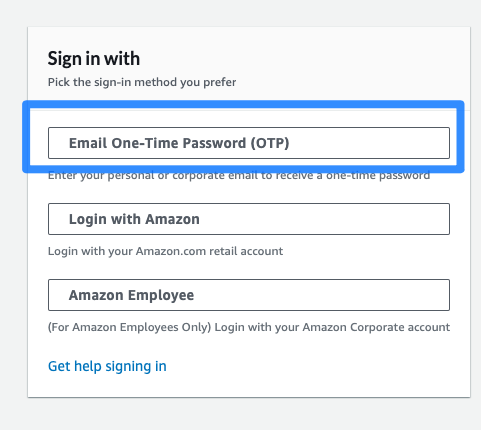
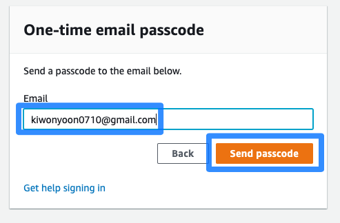
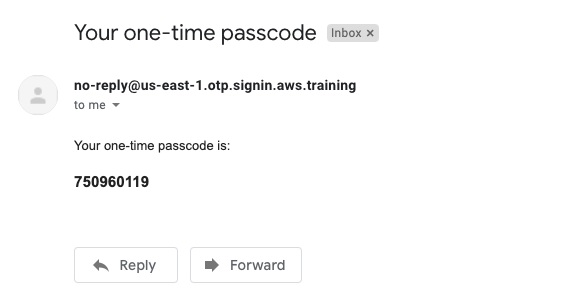
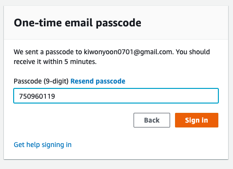

#### Event Engine 접속

1. Go to [Event Engine Dashboard ](https://dashboard.eventengine.run/), 제공 받은 Access Code를 입력하고 "Accept" Click

---

2. "Email One-Time Password(OTP)" Click

---

3. 본인 이메일을 입력 후 "Send passcode" Click

---

4. 이메일에서 OTP Code 확인

---

5. 복사한 OTP CODE를 입력 후 "Sign In" Click

---

6. **Team Dashboard**에서 "AWS Console"을 클릭

---

7. "Open AWS Console"을 클릭하여 Console 접속 

---

[<다음>Workshop01-KeyPair생성으로 이동 ](./01-KeyPair.md) 

