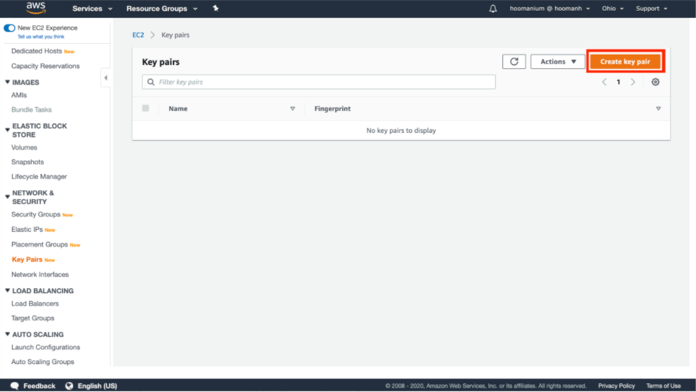
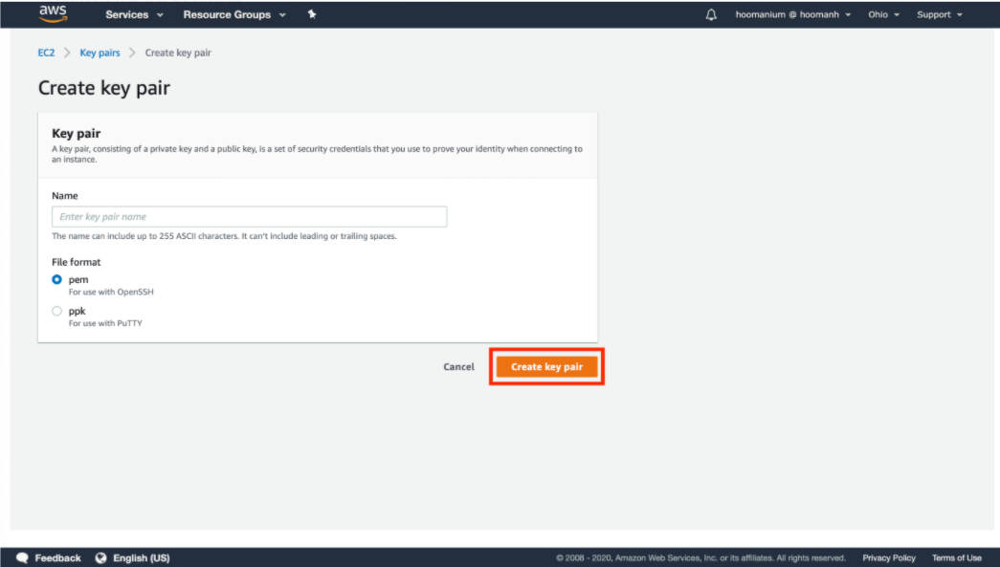

## Key Pair 생성

---

1. [여기 ](http://amzn.to/2kcoMQp) 를 새 창(새 탭)으로 띄워서 Key Pair로 이동합니다. 

---

2. "Create Key Pair"를 클릭합니다.

---

3. DMSKeyPair라고 입력하고 "Create"를 클릭 합니다. 자동으로 DMSKeyPair.pem 파일이 다운로드 됩니다.

   해당 pem 파일을 잘 저장해둡니다.

---

4. [<다음>Workshop02-실습환경생성으로 이동 ](./02.md) 

