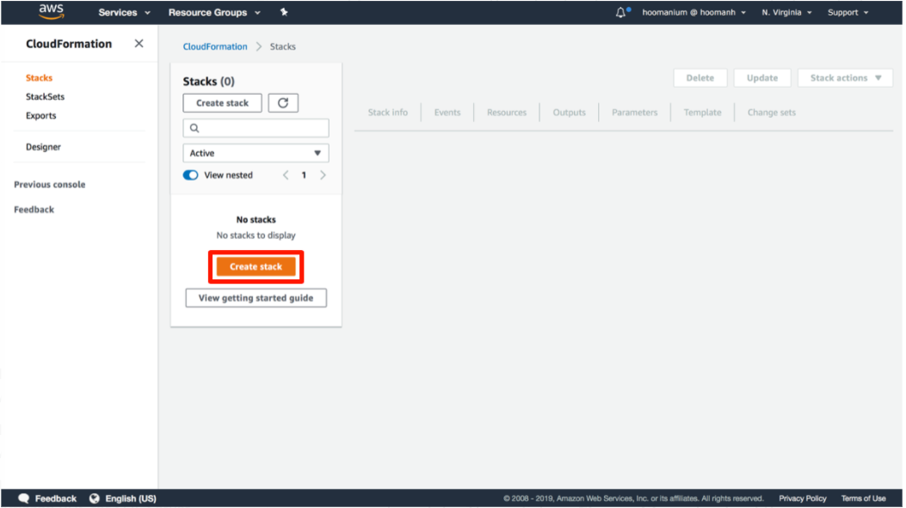
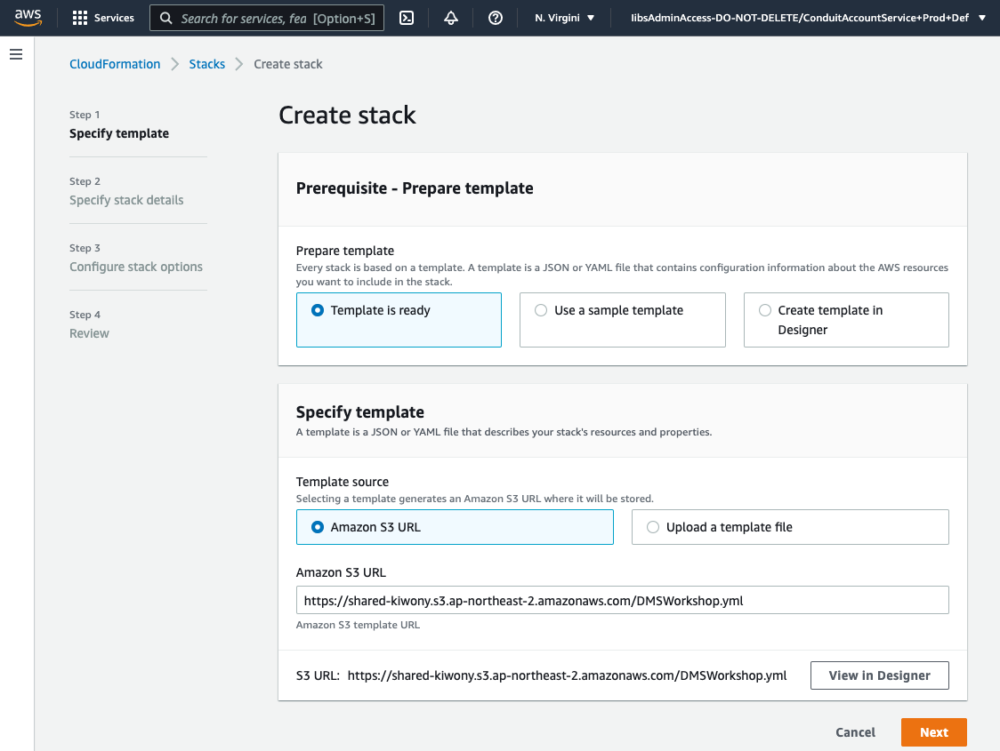
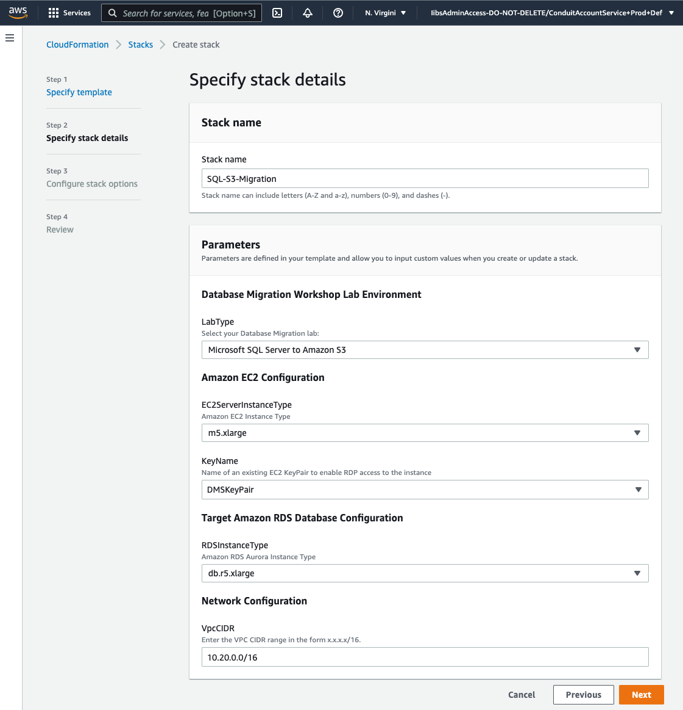
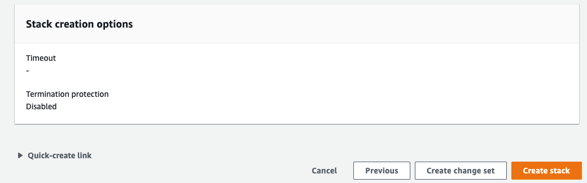
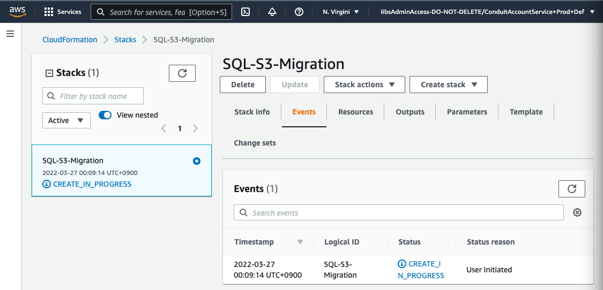
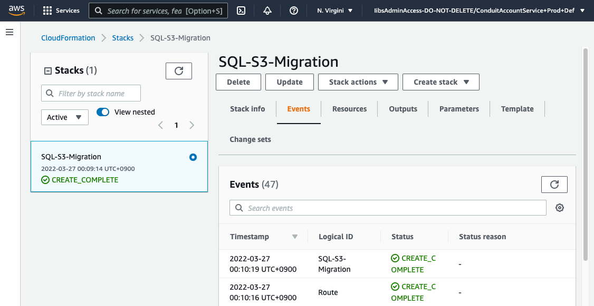
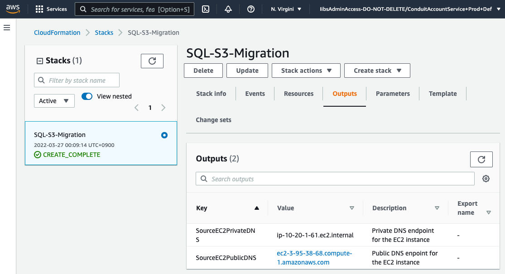

## 실습 환경 생성

---

1. [여기 ](https://console.aws.amazon.com/cloudformation/) 를 새 창(새 탭)으로 띄워서 CloudFormation으로 이동합니다.

---

2. "Create stack"을 클릭합니다.



---

3. Amazon S3 URL 부분에 `https://shared-kiwony.s3.ap-northeast-2.amazonaws.com/DMSWorkshop.yml` 를 입력합니다. 입력 후 "Next"를 Click 합니다.



---

4. 다음과 같이 입력 하고 "Next"를 클릭 합니다.

   ```
   Stack Name : SQL-S3-Migration
   
   LabType : Microsoft SQL Server to Amazon S3
   EC2ServerInstanceType : m5.2xlarge
   KeyName : DMSKeyPair.pem 또는 DMSKeyPair.cer
   
   RDSInstanceType : db.r5.xlarge
   VpcCIDR : 10.20.0.0/16
   ```



---

5. "Configure stack options" Page에서 "Next"를 Click

---

6. Review Page에서 "Create stack" Click



---

7. CloudFormation이 CREATE_IN_PROGRESS로 바뀌는 것을 확인하고 CREATE_COMPLETE 가 될때까지 기다립니다. (약 5분 소요 - Coffee Break)





---

8. Outputs Tab을 Click하여 SourceEC2PrivateDNS, SourceEC2PublicDNS 정보를 확인하고, 메모장등에 저장합니다.



---

9. [<다음>Workshop03-MSSQL데이터 S3이관으로 이동 ](./03r.md) 


