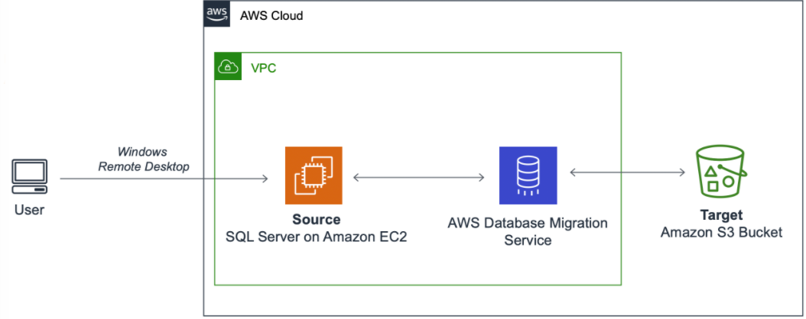
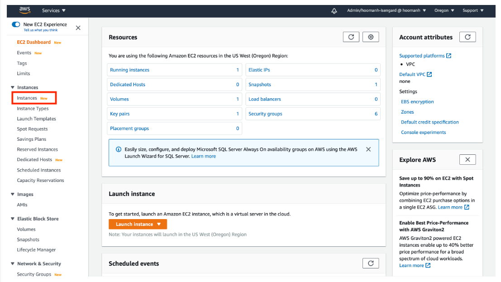
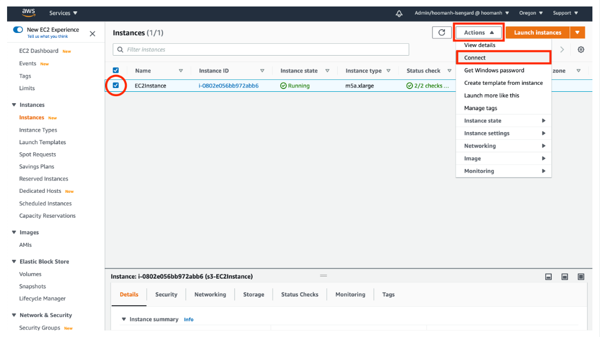
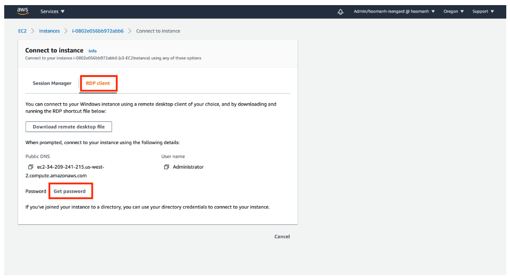
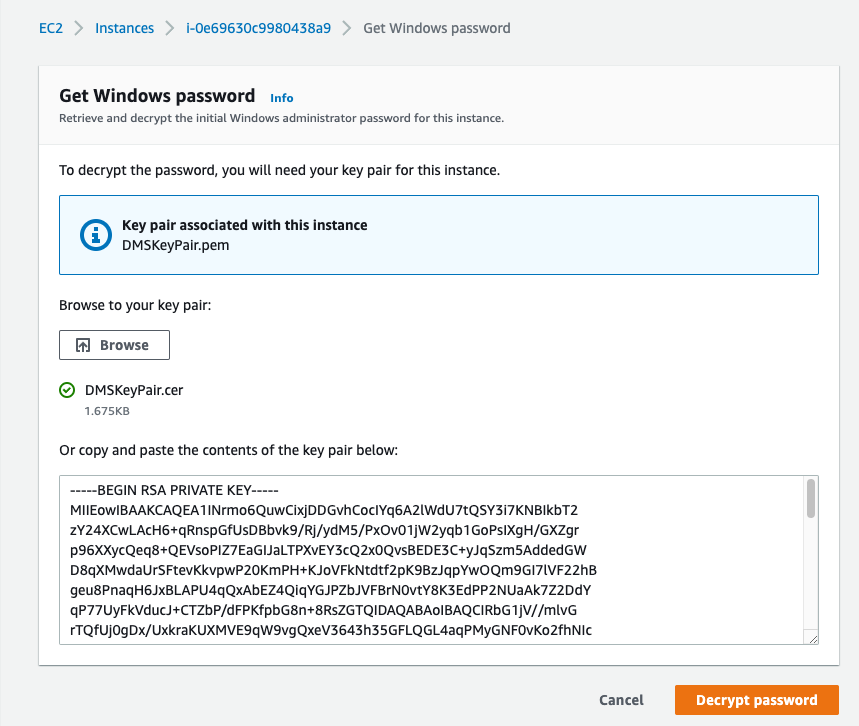
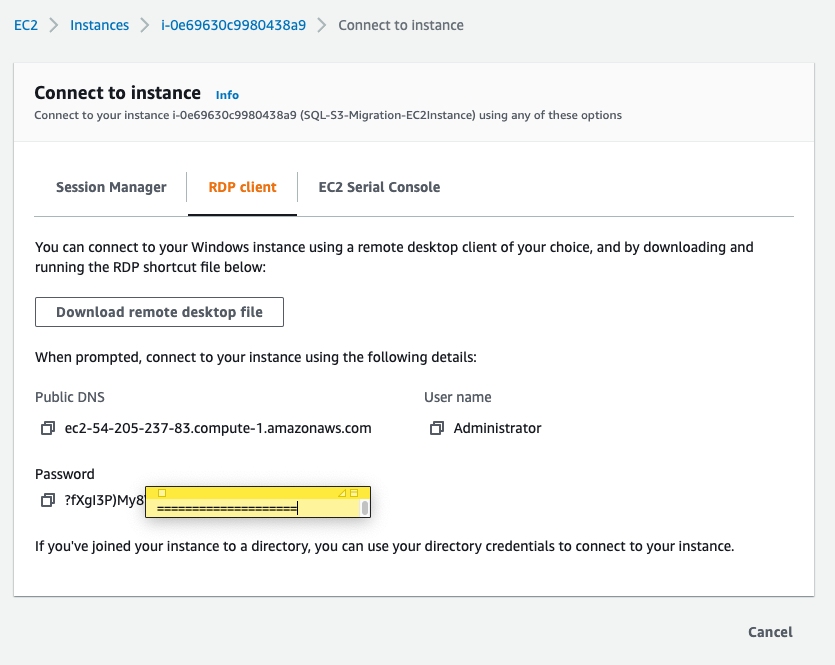

## Microsoft SQL Server Data를 Amazon S3로 Migration

---

### Architecture diagram



**EC2에 설치된 SQL Server의 Data를 "Database Migration Service"를 사용하여 Amazon S3로 Migration하게 됩니다.**

---

#### EC2 Instance 접속

1. [console](http://amzn.to/2atGc3r) 을 새 창(새탭)으로 띄우고, 왼쪽 메뉴의 Instances를 Click



---

2. **<StackName>-EC2Instance**를 선택하고 Actions => Connect 실행



---

3. **RDP client** 를 Click 하고 **Get Password**를 Click



---

4. **Browse**를 Click하고 아까 다운 받았던 **DMSKeyPair.pem 또는 DMSKeyPair.cer** 를 업로드
5. **Decrypt Password** 를 Click



---

6. 확인된 Windows Password를 메모장등에 적어둡니다.



---

7. Remote Desktop(mstsc.exe)을 실행하고 아까 적어둔 SourceEC2PublicDNS에 해당하는 Host로 접속합니다.

```
User Name : Administrator
Password : 위에서 확인한 Password 사용 
```


