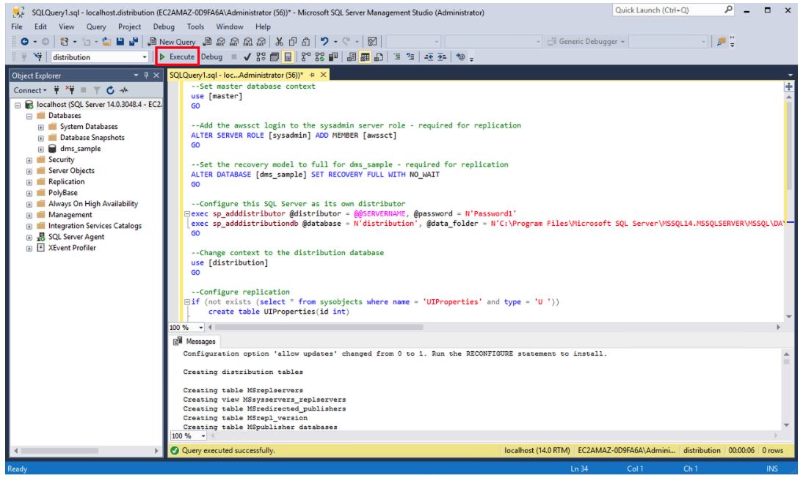

## Microsoft SQL Server Data를 Amazon S3로 Migration

---

### Architecture diagram


**EC2에 설치된 SQL Server의 Data를 "Database Migration Service"를 사용하여 Amazon S3로 Migration하게 됩니다.**

---

#### EC2 Instance 접속

1. [console](http://amzn.to/2atGc3r) 을 새 창(새탭)으로 띄우고, 왼쪽 메뉴의 Instances를 Click


---

2. **<StackName>-EC2Instance**를 선택하고 Actions => Connect 실행


---

3. **RDP client** 를 Click 하고 **Get Password**를 Click


---

4. **Browse**를 Click하고 아까 다운 받았던 **DMSKeyPair.pem 또는 DMSKeyPair.cer** 를 업로드
5. **Decrypt Password** 를 Click


---

6. 확인된 Windows Password를 메모장등에 적어둡니다.


---

7. Remote Desktop(mstsc.exe)을 실행하고 아까 적어둔 SourceEC2PublicDNS에 해당하는 Host로 접속합니다.

```
User Name : Administrator
Password : 위에서 확인한 Password 사용 
```

---

8. **시작** 을 누르고 **SQL Server Management Studio** 을 실행


---

9. **Connect** 를 Click


---

10. [ConfigSourceSQLServer.sql ](https://static.us-east-1.prod.workshops.aws/public/8eed7861-c4d7-43ff-b06e-cb0261d44c17/static/code/ConfigSourceSQLServer.sql) 를 다운로드 하고, 메모장등으로 열어서 내용을 복사 

---

11. 복사한 Query를 **SQL Server Management Studio** 에 입력
12. **Execute** 로 Query 실행




----

[<다음>Workshop04-Target S3 Bucket구성으로 이동 ](./04.md) 

---


