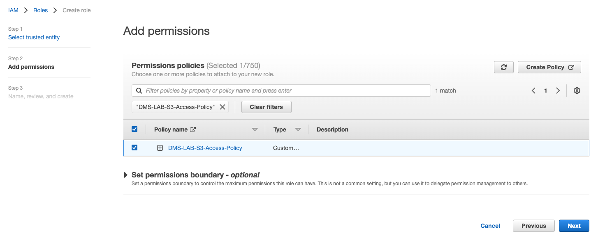

## Target S3 Bucket 구성

---

1. Open the [Amazon S3 console ](https://console.aws.amazon.com/s3/), **Create Bucket** Click


---

2. Bucket 이름은 Unique해야 합니다. **dmstargetbucket-YourInitial-RandomNumber** Format으로 이름을 사용하세요. **Create Bucket** Click


---

3. 방금 생성한 Bucket을 Click 하여 들어갑니다. 

   **Create Folder** 를 Click하고 **dmstargetfolder** 라는 이름의 Folder를 생성합니다.

   **Create Folder** 를 Click하고 **query_result** 라는 이름의 Folder를 생성합니다.


---

4. Navigate to the [IAM console ](https://console.aws.amazon.com/iam/) 을 새 창(새탭)으로 띄우고, 좌측 메뉴 중 **Policies** Click


---

5. **Create policy** 를 Click하고, JSON Tab을 선택 합니다

   아래의 Code를 입력 하고 **REPLACE-WITH-YOUR-BUCKET-NAME** 부분을 위에서 생성한 Bucket이름으로 변경

   Bucket 이름 뒤에 ***** 을 꼭 넣어줍니다.

   

```
{
"Version": "2012-10-17",
"Statement": [
{
"Effect": "Allow",
"Action": [
"s3:PutObject",
"s3:DeleteObject"
],
"Resource": [
"arn:aws:s3:::REPLACE-WITH-YOUR-BUCKET-NAME*"
]
},
{
"Effect": "Allow",
"Action": [
"s3:ListBucket"
],
"Resource": [
"arn:aws:s3:::REPLACE-WITH-YOUR-BUCKET-NAME*"
]
}
]
}

```


---

5-1. **Next Tags** Click

5-2.  **Next Review** Click

5-3. **Name** : `DMS-LAB-S3-Access-Policy` 입력 하고 **Create Policy** Click


---

6. 방금 생성한 Policy를 Role로 Mapping 합니다.

   Open the [IAM console ](https://console.aws.amazon.com/iam/), 좌측 메뉴 중  **Roles** Click


---

7. **Create Role** Click

   **Use cases for other AWS Services** 에서 **DMS**를 선택 하고 **Next** Click


---

8. **Add Permissions** 화면에서 위에서 생성한 Policy - `DMS-LAB-S3-Access-Policy` 를 검색 -> 선택 후 **Next** Click



---

9. **Role Name** 에 `DMS-LAB-Role` 을 입력 하고 **Create Role** Click


---

10. **Role DMS-LAB-Role Created** 메시지를 확인 후, **View Role** 을 Click하여 방금 생성한 Role을 확인


---

11. ARN을 확인하고 메모장에 복사해둡니다.


---

[<다음>Workshop05-DMS구성으로 이동 ](./05.md) 


