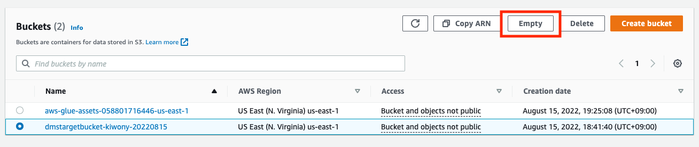

## Transaction이 포함된 S3 Data생성

---

#### Source Database에는 Transaction Data가 포함되어 있지 않기 때문에, S3에 저장된 기존 Data를 모두 삭제하고  Transaction Data가 포함된 Data를 새롭게 복사합니다.


---

1. S3 [console ](https://s3.console.aws.amazon.com/s3/home?region=us-east-1#) 을 새 창(새탭)으로 엽니다.

---

2. dmstargetbucket-<INITIAL>-<RANDOM-NUMBER> 버킷을 선택하고 **Empty**를 Click.




3. 정말 삭제 할 것인지 묻는 창에서 **permanetly delete**를 입력하고 **Empty** Click

   Empty Bucket :status 확인


---

4. CloudShell  [console ](https://us-east-1.console.aws.amazon.com/cloudshell/home?region=us-east-1#) 을 새 창(새탭)으로 엽니다.

5. Prompt가 보이면 아래 Command를 실행합니다. <YourBucketName> 을 생성한 Bucket명으로 바꿉니다.

```
aws s3 cp --recursive --copy-props none s3://aws-dataengineering-day.workshop.aws/data/ s3://<YourBucketName>/dmstargetfolder/dbo/

```

**Example**

```
[cloudshell-user@ip-10-1-149-83 ~]$ aws s3 cp --recursive --copy-props none s3://aws-dataengineering-day.workshop.aws/data/ s3://dmstargetbucket-kiwony-20220815/dmstargetfolder/dbo/
copy: s3://aws-dataengineering-day.workshop.aws/data/dms_sample/name_data/LOAD00000001.csv to s3://dmstargetbucket-kiwony-20220815/dmstargetfolder/dbo/dms_sample/name_data/LOAD00000001.csv
copy: s3://aws-dataengineering-day.workshop.aws/data/dms_sample/nfl_stadium_data/LOAD00000001.csv to s3://dmstargetbucket-kiwony-20220815/dmstargetfolder/dbo/dms_sample/nfl_stadium_data/LOAD00000001.csv
copy: s3://aws-dataengineering-day.workshop.aws/data/dms_sample/sport_location/LOAD00000001.csv to s3://dmstargetbucket-kiwony-20220815/dmstargetfolder/dbo/dms_sample/sport_location/LOAD00000001.csv
...
copy: s3://aws-dataengineering-day.workshop.aws/data/dms_sample/ticket_purchase_hist/LOAD00000001.csv to s3://dmstargetbucket-kiwony-20220815/dmstargetfolder/dbo/dms_sample/ticket_purchase_hist/LOAD00000001.csv
copy: s3://aws-dataengineering-day.workshop.aws/data/dms_sample/seat/LOAD00000001.csv to s3://dmstargetbucket-kiwony-20220815/dmstargetfolder/dbo/dms_sample/seat/LOAD00000001.csv
copy: s3://aws-dataengineering-day.workshop.aws/data/dms_sample/sporting_event_ticket/LOAD00000001.csv to s3://dmstargetbucket-kiwony-20220815/dmstargetfolder/dbo/dms_sample/sporting_event_ticket/LOAD00000001.csv
```

---


[<다음>Workshop06(Glue와 Glue Studio)으로 이동 ](./06.md) 


