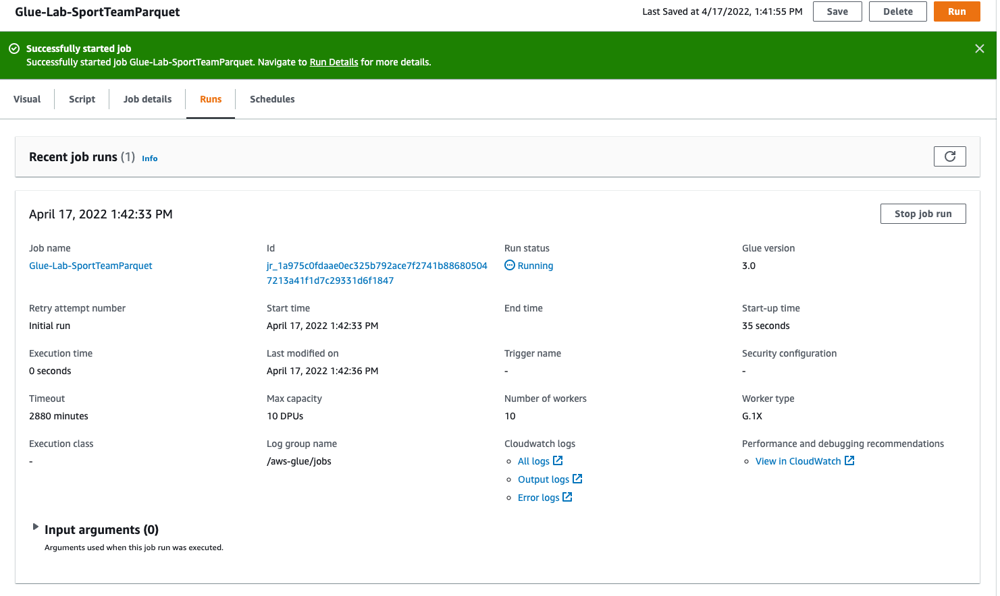

## Glue를 이용한 Metadata Catalog 및 ETL

---

**Architecture Diagram**


---

## Glue Role 생성

---

1. [IAM Console ](https://us-east-1.console.aws.amazon.com/iamv2/home#/roles) 을 새창(새탭)을 엽니다. 

---

2. **Create Role** 을 Click 합니다.

---

3. **Use cases for other services** 에서 **Glue** 를 선택하고  **Next** Click


---

4. **Add Permissions** Page 에서 `AWSGlueServiceRole` 과 `AmazonS3FullAccess` 를 선택 하고 **Next** Click


---

5. **Role Name** 에 `GlueAdminRole` 을 입력 하고, `AmazonS3FullAccess`, `AWSGlueServiceRole` 퍼미션이 있는지 확인 후 **Create role** Click


---

## Glue Catalog 수행

---

1.  [AWS Glue Console ](https://console.aws.amazon.com/glue/home) 을 새창(새탭)을 엽니다.

---

2. 메뉴 좌측 **Crawlers** Click후  

   **Add Crawler** Click. 


---

3. `glue-lab-crawler` 로 Crawler Name 입력

   **Next** Click


---

4. **Specify crawler source type** Deafult로 유지하고 **Next** Click


---

5. 다음과 입력/선택 하고 **Next** Click

```
Choose a data source : S3
Crawl data in : Specified path in my account
Include path : dmstargetbucket-<yourinitial>-<xxxx>/dmstargetfolder/dbo/

```


---

6. **Add another data store** Page에서 **No**로 그대로 두고, **Next** Click


---

7. **Choose an existing IAM Role** 을 선택하고`GlueAdminRole` 을 입력 후 **Next** Click


---

8. **Create a schedule for this crawler** Page에서 Frequency **Run on deman** 로 두고 **Next** Click


---

9. **Configure the crawler's output** Page 에서 **Add database** Click 후 `ticketdata` 를 Database Name으로 설정


---

10. **Review** Page에서 내용 확인 후 **Finish** Click


---

11. 방금 생성한 **glue-lab-cralwer** 를 선택 후 **Run crwaler** 실행 

    **Crawler는 S3에 저장된 CSV File들을 읽어서, Metadata(Schema)를 자동으로 파악하고 Catalog DB에 저장**


---

12. 1~2분 후 15개의 Table의 Metadata를 추출하여 Catalog DB에 저장함을 확인


---

13. 화면 좌측 **Databases** 아래 **Tables** Click하여 S3에 저장된 CSV 파일들에 해당하는 Metadata를 확인


---

### Data Validation 

---

1. **person** Table을 Click하여 테이블 구조를 확인


---

### Data ETL 수행

---

1. 메뉴 좌측의 **AWS Glue Studio** Click
2. **View  Jobs** Click


---

3. **Visual with a source and target** 선택 후 **Create** Click


---

4. Diagram 중 **Data source - S3 bucket** 을 Click 하고 아래와 같이 설정

```
S3 source type : Data Catalog table
Database : ticketdata
Table : sport_team
```


---

5. Diagram 중 **Transfrom - ApplyMapping** 을 Click하고 아래와 같이 설정

```
id : double
name : string
abbreviated_name : string
home_field_id : long
sport_type_name : string
sport_league_short_name : string
sport_division_short_name : string

```


---

6. Diagram 중 **Data target - S3 bucket** 을 Click하고 아래와 같이 설정

```
Format : Parquet
Compression Type : None
S3 Target Location : Browse S3를 Click하여 dmstargetbucket-<yourinitial>-<xxxx>를 선택하고 뒤에 추가 경로로 /dms_parquet/sport_team/ 를 추가합니다.(맨 뒤에 /를 꼭 넣어주세요)

Data Catalog update options : Create a table in the Data Catalog and on subsequent runs, keep existing schema and add new partitions

Database : ticketdata
Table name : parquet_sport_team
```


---

7. **Job details** Tab을 Click하고 아래 처럼 설정 후 화면 맨 우측 상단 **Save** Click

```
Name : Glue-Lab-SportTeamParquet
IAM Role : GlueAdminRole
Job bookmark : Disable
Number of retries : 0
Job timeout (minutes) : 5
```


---

8. 화면 우측 상단 **RUN** Click 후  **Run Details** 를 눌러서 Job status 확인




---

9. 메뉴 좌측의 **Monitoring** 을 Click하면 수행중인 Job의 전체적인 상황을 볼 수 있습니다.


---

10. Job이 끝나면 Monitoring에서 Success로 변경됩니다.


---

11. S3 Bucket으로 이동하여 parquet FIle이 생성되었는지 확인 


---

### 위의 ETL Parquet 변경 작업을 아래의 4개 테이블에서도 수행합니다. Table 별로 bucket dest/folder 와 column의 Data type이 변경이 필요합니다.

```
sport_location
sporting_event
sporting_event_ticket 
person
```

---

#### sport_location

```
# Data source - S3 Bucket
Table : sport_location

# Transform - ApplyMapping
변경 없음

# Data target - S3 Bucket
S3 Target bucket dest : /dms_parquet/sport_location/

Data Catalog update options : Create a table in the Data Catalog and on subsequent runs, keep existing schema and add new partitions

Database : ticketdata
Table name : parquet_sport_location

JobName : Glue-Lab-SportLocationParquet
```

---

#### sporting_event

```
# Data source - S3 Bucket
Table : sporting_event

# “Transform - ApplyMapping” 부분에서 Data type 변경 
column “start_date_time” => TIMESTAMP
column “start_date” => DATE

S3 Target bucket dest : /dms_parquet/sporting_event/

Data Catalog update options : Create a table in the Data Catalog and on subsequent runs, keep existing schema and add new partitions

Database : ticketdata
Table name : parquet_sporting_event

JobName : Glue-Lab-SportingEventParquet
```

---

#### sporting_event_ticket

```
# Data source - S3 Bucket
Table : sporting_event_ticket

# “Transform - ApplyMapping” 부분에서 Data type 변경 
column “id” => DOUBLE
column “sporting_event_id” => DOUBLE
column “ticketholder_id” => DOUBLE

S3 Target bucket dest : /dms_parquet/sporting_event_ticket/

Data Catalog update options : Create a table in the Data Catalog and on subsequent runs, keep existing schema and add new partitions

Database : ticketdata
Table name : parquet_sport_event_ticket

JobName : Glue-Lab-SportingEventTicketParquet
```

---

#### person

```
# Data source - S3 Bucket
Table : person

# “Transform - ApplyMapping” 부분에서 Data type 변경 
column “id” => DOUBLE

S3 Target bucket dest : /dms_parquet/person/

Data Catalog update options : Create a table in the Data Catalog and on subsequent runs, keep existing schema and add new partitions

Database : ticketdata
Table name : parquet_person

JobName : Glue-Lab-PersonParquet
```

---

### Clone Job을 이용하여 4개 Table을 Parquet으로 변경

---

1. 화면 좌측의 **Jobs** Click

---

2. **Your Jobs** 에서 **Glue-Lab-SportTeamParquet** 을 선택하고 **Actions** => **Clone Jobs** 


---

3. 위의 Table 별 **Data Source**, **Transform Rule**, **Data Target** 을 확인하고 JOB을 수정하고 저장, 실행

---

#### Glue-Lab-SportLocationParquet


---

#### Glue-Lab-SportingEventParquet


---

#### Glue-Lab-SportingEventTicketParquet


---

#### Glue-Lab-PersonParquet


---

#### 총 5개 Table의 Parquet 변환 Job 상태 확인 및 결과 확인


---

#### Glue Catlog에서 Parquet Table Metadata 확인


---

[<다음>Workshop07-Athena Query 및 Quicksight 시각화 이동 ](./07.md) 


