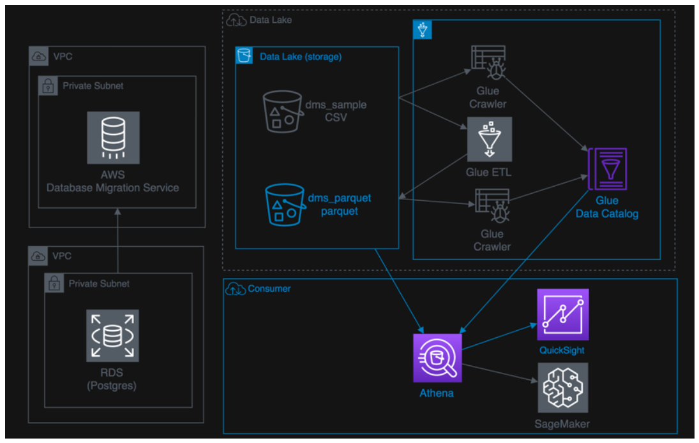
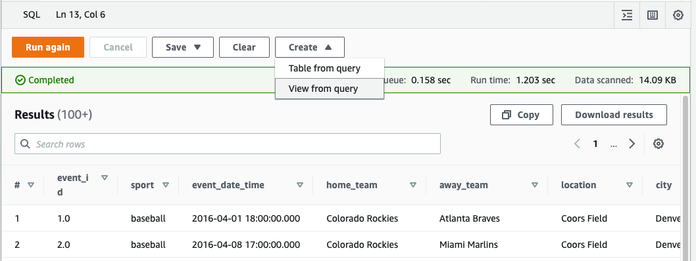
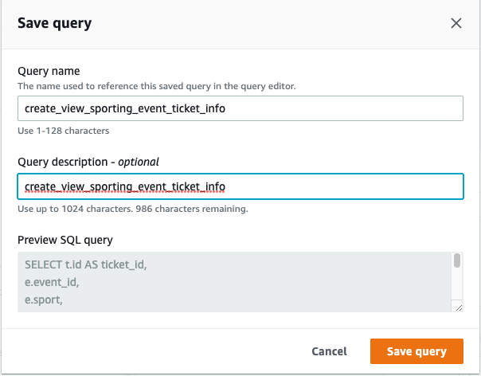
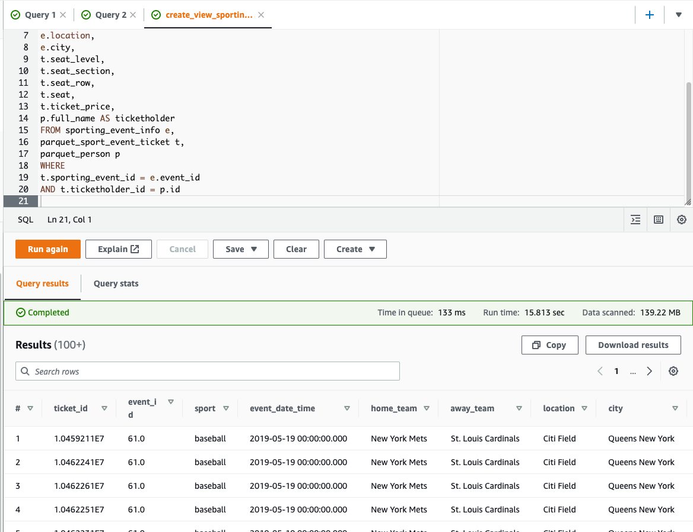
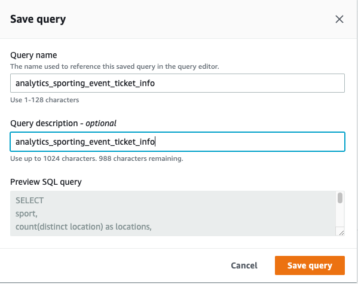
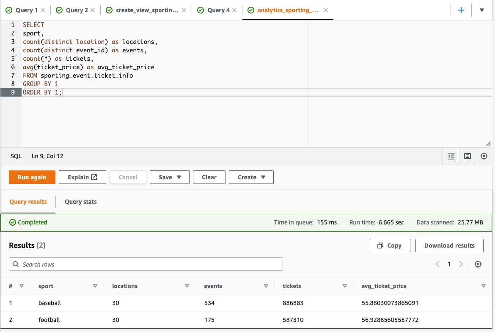
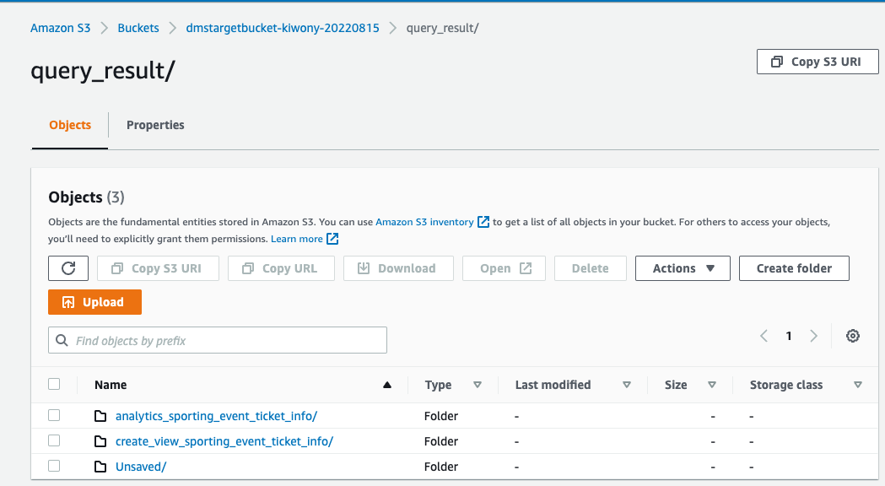

## S3에 저장된 Data lake Data를 Athena를 통해 Query

---

**S3에 csv로 저장된 Data를 ETL을 통해  Parquest으로 변환하고 이를 조회 및 시각화**



---

1. Athena [console ](https://console.aws.amazon.com/athena/home?region=us-east-1) 을 새 창(새탭)으로 엽니다.

---

2. Query Result Folder를 지정합니다. 

   **View settings** Click

   **Manage** Click

   **Browse S3** Click 후 dmstargetbucket-<yourinitial>-<xxxx> 을 선택 후 **query_result** 선택

   **Save** Click


---

3. **Editor** Tab Click 

```
Data Source : AwsDataCatalog
Database : ticketdata
Tables and views 에서 parquet 으로 필터링
```


---

4. **parquet_sporting_event_ticket** Table의 Data type을 확인. 

   `id, sporting_event_id, ticketholder_id`가 모두 double인지 확인


---

5. 다음의 Query를 Editor - **Query 1**에 붙여 넣고 실행

```
SELECT
e.id AS event_id,
e.sport_type_name AS sport,
e.start_date_time AS event_date_time,
h.name AS home_team,
a.name AS away_team,
l.name AS location,
l.city
FROM parquet_sporting_event e,
parquet_sport_team h,
parquet_sport_team a,
parquet_sport_location l
WHERE
e.home_team_id = h.id
AND e.away_team_id = a.id
AND e.location_id = l.id;

```


---

6. **Create** Click 후 **View from query**  선택 후 `sporting_event_info` 를 입력 후 **Create** Click

   **Data** Refresh를 화면 방금 생성 한 **sporting_event_info** View 확인




---

7. **Query 3** 창을 열고 아직 실행하지 않고 8번 Step으로 이동.

```
SELECT t.id AS ticket_id,
e.event_id,
e.sport,
e.event_date_time,
e.home_team,
e.away_team,
e.location,
e.city,
t.seat_level,
t.seat_section,
t.seat_row,
t.seat,
t.ticket_price,
p.full_name AS ticketholder
FROM sporting_event_info e,
parquet_sport_event_ticket t,
parquet_person p
WHERE
t.sporting_event_id = e.event_id
AND t.ticketholder_id = p.id

```


8. **Save** => **Save as** =>Name부분에  **create_view_sporting_event_ticket_info**을 넣고 **Save query** Click



9. **Run** 을 Click하여 query를 실행합니다.




10. **Create** => **Create view from query** => Name에 **sporting_event_ticket_info** 을 입력 후 **Create** Click

---

11. Editor창을 하나 더 열고 다음의 Query를 입력 

```
SELECT
sport,
count(distinct location) as locations,
count(distinct event_id) as events,
count(*) as tickets,
avg(ticket_price) as avg_ticket_price
FROM sporting_event_ticket_info
GROUP BY 1
ORDER BY 1;

```

12. **Save** => **Save as** => **analytics_sporting_event_ticket_info** 입력 후 **Save query** Click





13. **Run** Click

    Parquet으로 변환된 File을 약 25MB Read하였으며, 6초 정도가 걸렸습니다. 원본인 CSV 파일을 읽었다면 약 1.59GB의 Read가 필요했을 것입니다.



---

14. **Save as**로 SQL을 특정 이름으로 저장하고 Athena에서 Query를 수행 할 경우 Athena Query Result에 해당 SQL의  이름으로 Data가 저장됩니다. **Save**를 하지 않을 경우 **Unsaved**에 Default로 저장됩니다.



---

[<다음>Workshop08-Quicksight 시각화 이동 ](./08.md)

