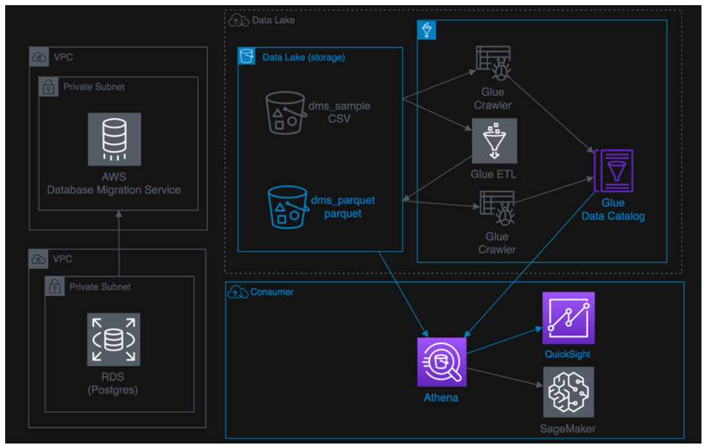
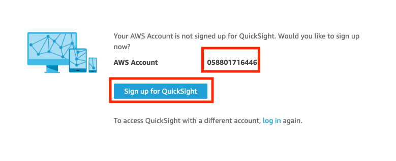
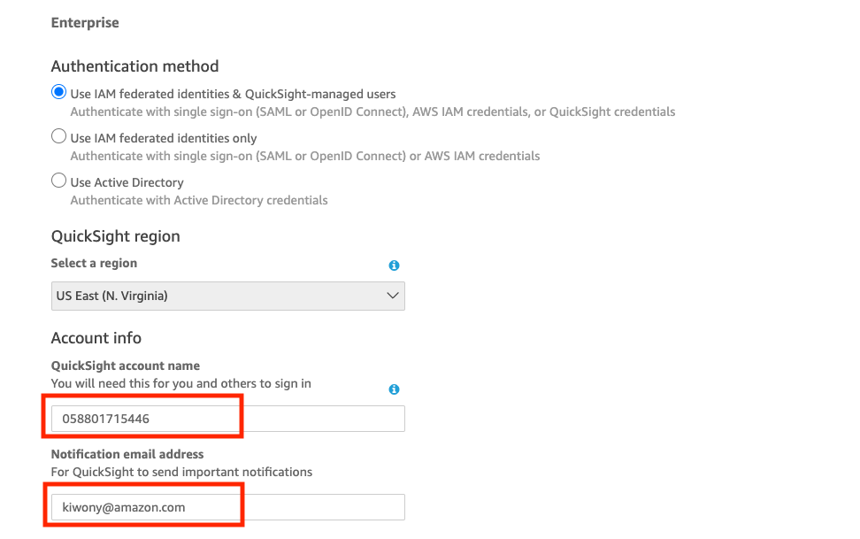
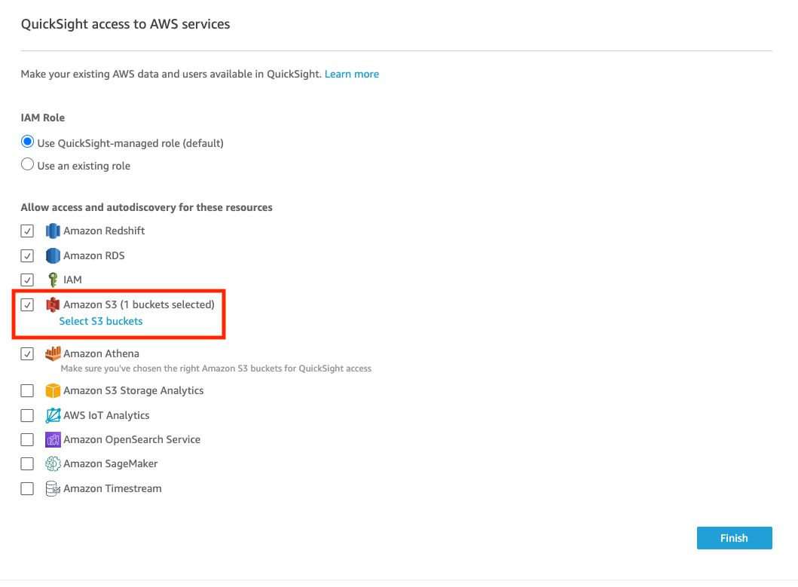
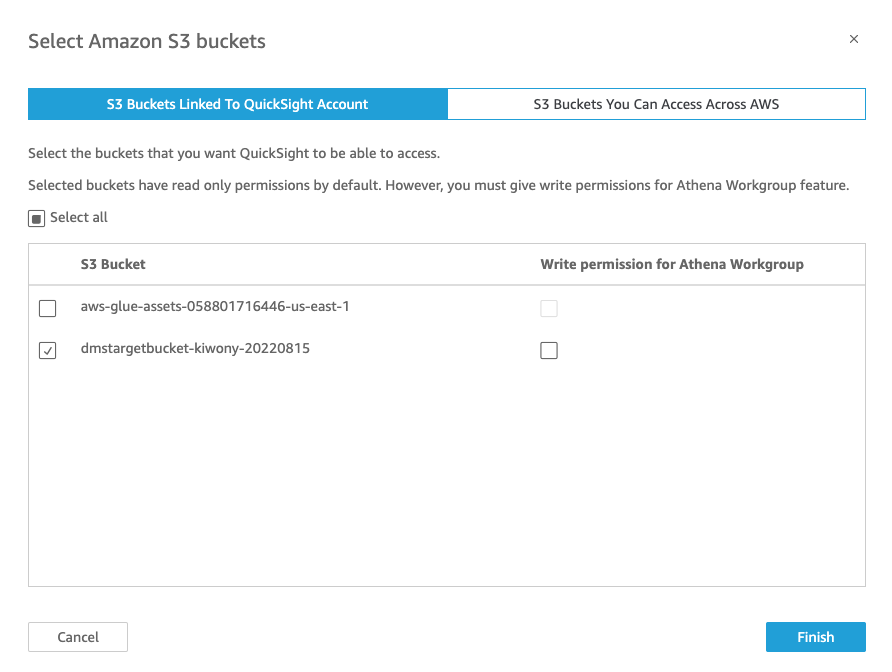
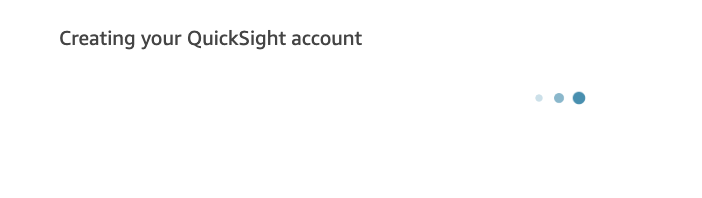
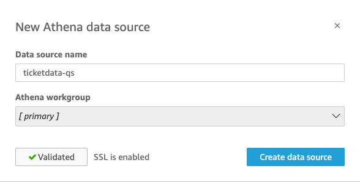
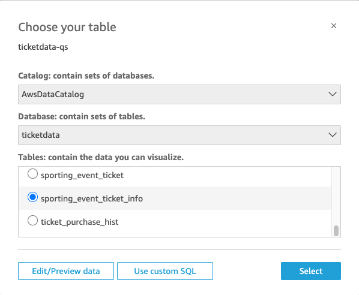
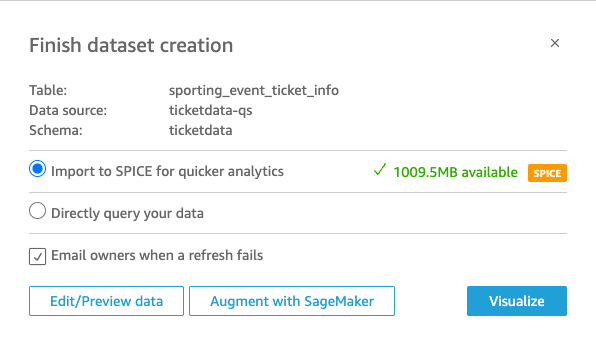

## Amazon QuickSight를 활용한 시각화

---

**S3의 Data가 Glue를 이용하여 변환 및 Cataloging되었고, 이 데이터를 Quicksight로 시각화합니다.**

---

1. Quicksight [console ](https://quicksight.aws.amazon.com/sn/start) 을 새 창(새탭)으로 엽니다.

2. AWS Account 숫자를 메모장에 복사해둡니다.
3. **Sign up for Quicksight**를 Click합니다.

4. **Enterprise**를 선택 후 **Continue** Click

5. QuickSight account Name 에 2번 Step에서 복사 해둔 Account 숫자를 입력합니다. 

   Notification email address에는 본인의 Email주소를 입력합니다.

6. **QuickSight access to AWS services** 에서 Amazon S3 앞의 CheckBox를 Check합니다. 

   Check하면 **Select Amazon S3 buckets** 이라는 팝업창이 뜹니다. 

   여기에서 본인이 만들었던 S3 Bucket dmstargetbucket-<INITIAL>-<RANDOM-NUMBER> Bucket을 Check하고 **Finish**를 Click합니다. 다시 한번 **Finish**를 Click 합니다.

---

7. QuickSight 계정 생성까지 기다립니다.

8. 계정 생성 후 **Go to Amazon QuickSight** 를 Click

---

9. **New anlysis** Click
10. **New dataset** Click

11. **Athena** Click

12. **Data source name** 에 **ticketdata-qs** 라고 입력 후 **Validate connection** Click

    **Create data source** Click

---

13. **Catalog** : AwsDataCatalog

    **Database** : ticketdata

    **Tables** : **sporting_event_ticket_info** 

    **Select** Click

---

14. **Import to SPICE for quicker analytics** 선택 후 **Visualize** Click

---

15. https://catalog.us-east-1.prod.workshops.aws/workshops/976050cc-0606-4b23-b49f-ca7b8ac4b153/en-US/800/810-athena-quicksight 로 접속하여 **Create QuickSight Charts** 들을 따라합니다.

---

